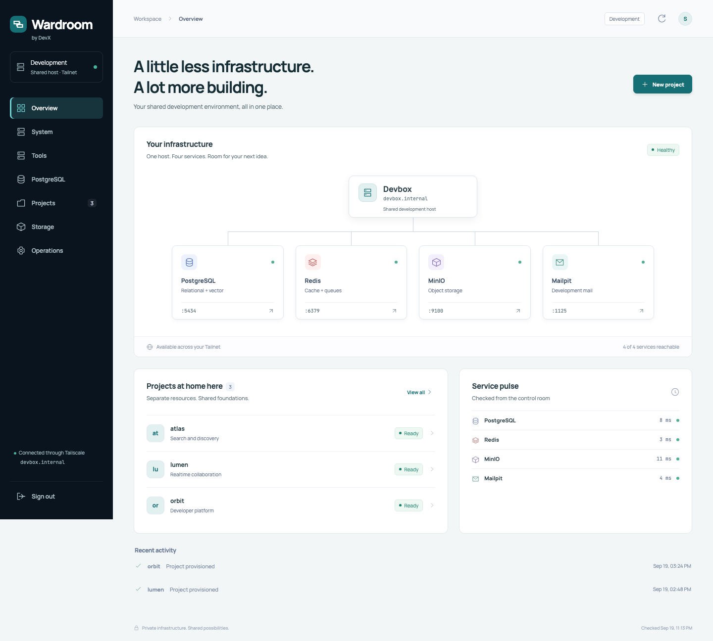
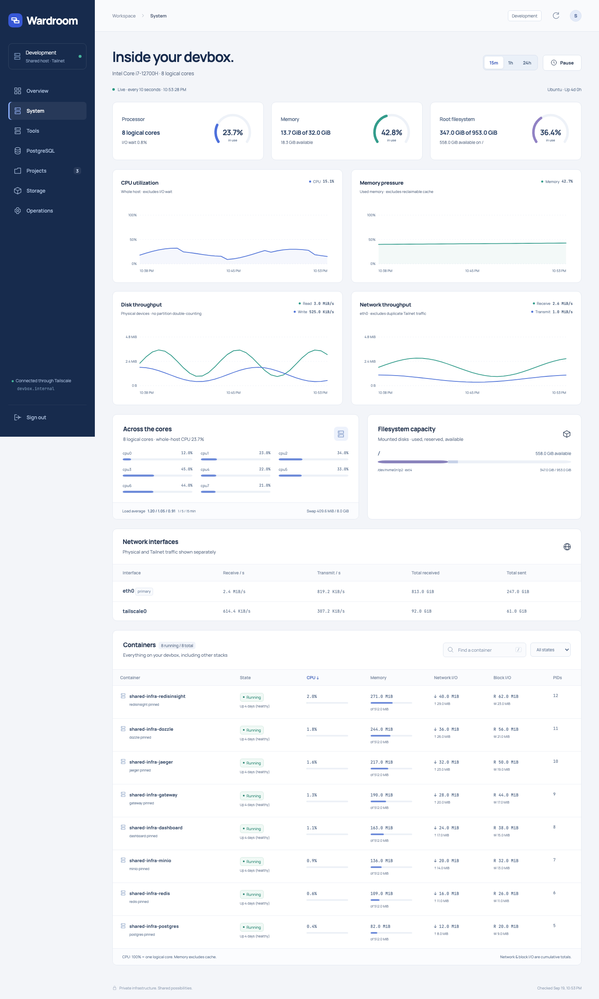
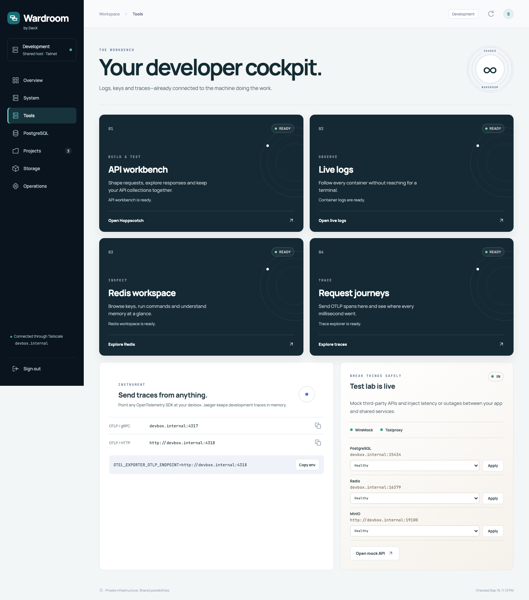
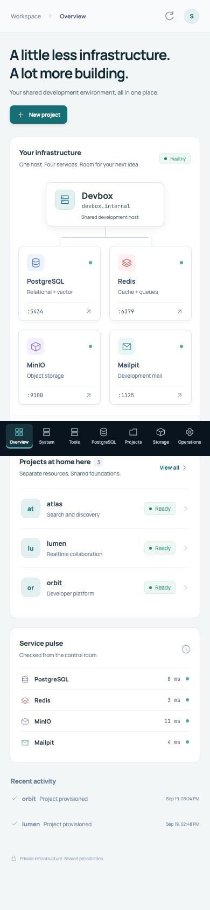

# Wardroom

**Shared services for your development workflow.**

Run one shared, batteries-included development stack on a remote Docker host. Reach it through Tailscale, operate it from a polished web control room, and stop making every project fight for the same ports on every laptop.

Wardroom is a self-hosted development tool for you and trusted teammates—not a hosted infrastructure service or a production platform. Use it for development databases, test data, captured emails, API experiments, and debugging. Shared credentials and lightweight isolation are deliberate conveniences for trusted development, not tenant-security boundaries. Do not put production workloads or real customer data here.



## What you get

| Foundation               | Developer experience                                                           |
| ------------------------ | ------------------------------------------------------------------------------ |
| PostgreSQL 18 + pgvector | Project-scoped roles, development/test databases, and a read-only web explorer |
| Redis 8                  | Persistent shared cache with project key-prefix conventions and RedisInsight   |
| MinIO                    | S3-compatible development/test buckets and browser console                     |
| Mailpit                  | Shared SMTP capture and email UI                                               |
| Jaeger v2                | OTLP over gRPC/HTTP and an in-memory trace explorer                            |
| Dozzle                   | Live logs for every container on the host through a read-only socket proxy     |
| Caddy                    | One memorable URL for the dashboard and every web tool                         |
| Host collector           | CPU, memory, storage, disk I/O, network, per-core, and container telemetry     |
| Optional test lab        | WireMock API simulation plus safe, preset-only Toxiproxy faults                |

Everything heavy runs on the devbox. Your workstation only needs Docker CLI, SSH, Node.js for development, and access to the same Tailnet.

## The control room

The built-in dashboard is more than a launcher:

- live topology and health checks;
- CPU, memory, storage, I/O, network, and container charts;
- PostgreSQL database, role, schema, table, and paged-record exploration;
- one-flow project provisioning for PostgreSQL, pgvector, MinIO, and Redis;
- authenticated access to logs, RedisInsight, Jaeger, and WireMock;
- copy-ready connection settings with credential placeholders;
- fixed fault profiles for latency, timeouts, and connection failures.





The interface is responsive too:

<p align="center"></p>

All screenshots use generated demo data. No real hostnames, projects, addresses, or credentials are included.

## How it fits together

```text
workstation                         remote devbox
┌──────────────────┐    Tailscale   ┌─────────────────────────────────────┐
│ Docker CLI       │ ─── SSH ─────▶ │ Docker Engine                       │
│ browser / apps   │ ─── HTTP/TCP ▶ │ Caddy → dashboard + web tools       │
└──────────────────┘                │ PostgreSQL · Redis · MinIO · Mailpit │
                                    │ Jaeger · Dozzle · optional test lab │
                                    └─────────────────────────────────────┘
```

Compose is always invoked from this repository with the named Docker context. It never changes your globally selected context. Volumes, images, networks, builds, and containers remain on the remote host.

## Quick start

Requirements: a Linux devbox reachable over SSH/Tailscale, Docker Engine on that box, Docker CLI + Compose locally, and Node.js 22+ for dashboard development.

```sh
cp .env.example .env
# Fill in the devbox Tailnet IP, SSH endpoint, and private credentials.

make context
make config
make up
make telemetry
make doctor
```

Open `http://<devbox-hostname>` or `http://<tailscale-ip>` and sign in with `DASHBOARD_PASSWORD`.

`make up` builds on the remote host and waits for health. The Compose wrapper verifies that `DOCKER_CONTEXT` (default: `wardroom`) still points at `DOCKER_ENDPOINT`. A missing RedisInsight encryption key is generated into the ignored `.env`; it is never committed or printed.

`devbox` in these examples is fictional: replace it with your machine's resolvable hostname or IP. Set the real values only in ignored `.env`, including `DOCKER_CONTEXT`, `DOCKER_ENDPOINT`, `SHARED_INFRA_HOST`, `SHARED_INFRA_BIND_IP`, `DASHBOARD_URL`, and `HOPPSCOTCH_HOST`. No custom DNS is configured by Wardroom.

The public product is **Wardroom**, published at [devxcloud/wardroom](https://github.com/devxcloud/wardroom). Existing runtime identifiers such as the `shared-infra` Compose project, database schema, and telemetry service remain stable to preserve deployed data.

### Private configuration

`.env`, `projects.local.json`, backups, test output, generated reports, and internal planning notes are ignored. Start an optional local project recipe with:

```sh
cp projects.example.json projects.local.json
```

The public recipe contains generic examples only. Local recipes never enter the Docker build context; the shared database registry is the runtime source of truth.

## One URL, several tools

After signing in to the control room, the same session protects:

| Path             | Tool                                           |
| ---------------- | ---------------------------------------------- |
| `/logs/`         | Dozzle live container logs                     |
| `/redis/`        | RedisInsight                                   |
| `/jaeger/`       | Jaeger trace explorer                          |
| `/mock/__admin/` | WireMock admin API when the test lab is active |

Send traces from development apps to `<tailscale-ip>:4317` (OTLP/gRPC) or `http://<tailscale-ip>:4318` (OTLP/HTTP).

Dozzle does not receive the Docker socket. A dedicated proxy exposes only read operations needed for container inventory and logs; POST, shell, and container actions are disabled.

## Project isolation

Provision from the dashboard or CLI:

```sh
PROJECT_DB_PASSWORD='<at-least-12-characters>' make provision PROJECT=example
make connections PROJECT=example
```

That creates:

- role `example`;
- databases `example` and `example_test`, both with pgvector;
- buckets `example` and `example-test`;
- Redis prefixes `example:` and `example:test:`.

Provisioning is serialized and retryable. It refuses ownership conflicts, duplicate resources, privileged role adoption, and silent password rotation. For parallel CI or agent runs, use unique names such as `example_run_42`.

## Optional failure lab

The test lab is intentionally off by default:

```sh
make lab-up
# Use the Tools page to apply a fixed fault profile.
make lab-down
```

WireMock simulates upstream APIs. Toxiproxy exposes private data-plane ports for PostgreSQL (`15434`), Redis (`16379`), and MinIO (`19100`). Its admin API is never published. The dashboard accepts only allowlisted targets and presets: healthy/reset, 500 ms latency, 2 s latency, timeout, or connection refused.

## API workbench

```sh
make api-up                 # generate private keys, provision, migrate, deploy
make api-down               # stop Hoppscotch; keep its database
```

Sign in at `http://devbox`, then open **Tools → API workbench**, or visit `http://devbox/api`. Caddy redirects to `http://devbox:3000` and checks the same dashboard session on every request, including the Hoppscotch backend and admin UI. No domain purchase or DNS change is required. For another devbox name or an IP-only setup, set `HOPPSCOTCH_HOST` in `.env` and use that same host for dashboard sign-in.

On first use, complete Hoppscotch's administrator onboarding at `http://devbox:3000/admin`. Its accounts are separate from the dashboard session. For trusted-team development, configure SMTP with `mailpit:1025` (no TLS or authentication); sign-in emails are captured by the shared Mailpit inbox. Anyone with inbox access can read those links, so this is not a production identity boundary.

Use the Browser interceptor for CORS-enabled APIs, or install the Hoppscotch Agent on your workstation for localhost APIs and CORS restrictions. The default public relay is deliberately replaced with an unusable loopback URL; select Browser or Agent instead of Proxy. Hosting the UI on devbox does not move request execution there.

The `hoppscotch` project uses the existing registry and provisioning rules, including the usual development/test databases and buckets. Only its development database is used by Hoppscotch. Keys remain in ignored `.env`; losing the encryption key can make stored encrypted configuration unreadable. Project collections and exported environments may contain secrets—keep them outside the public repository.

## Built-in infrastructure AI

Open **AI & MCP → Connection** to connect one OpenAI-compatible endpoint and model. Wardroom stores the optional API key encrypted in PostgreSQL with the private `AI_SETTINGS_KEY`; the browser receives only whether a key is saved. HTTPS is recommended. Private HTTP endpoints require explicit acknowledgement, and `localhost` means the dashboard container rather than your workstation.

**Chat** can inspect and change development infrastructure through the same validated, audited tool catalog as MCP. Choose a single project or workspace-admin scope before starting. Destructive access and project SQL are a separate, off-by-default choice that stays fixed for the conversation. Tool activity and exact resource targets remain visible in the transcript. Stop prevents later model/tool calls, but it cannot roll back an operation already dispatched.

Conversation history is temporary, belongs to the signed-in dashboard session, and expires after 30 minutes. Prompts, tool results, records and any credentials deliberately entered into chat go to the configured provider and may be retained or billed according to that provider's policy. Wardroom does not send a request when merely opening the page. **Test connection** sends a minimal prompt without infrastructure context.

The first release supports the streamed Chat Completions tool-call protocol. Compatible gateways and local inference servers vary; the selected model must support tool calls. Codex account/device login, multiple provider profiles, uploads, background jobs and persisted chat history are not included.

## Coding-agent tools (optional MCP)

Wardroom can provision and operate development resources for a coding agent—no built-in chat, model API key, or AI subscription is required. The optional MCP service exposes project provisioning, database/user lifecycle, project SQL, Redis and S3 editing, host metrics, owned mocks, fixed fault presets and restricted container controls.

Open **AI & MCP** in the main menu (direct link: `/#ai-mcp`) to create a project/admin token, select its expiry and destructive permissions, and copy installation commands or configuration for Claude Code, Codex, Grok Build or another MCP client. Save the one-time token privately. The dedicated page lists token scope, expiry and last authenticated use, and lets you revoke access. Inactive tokens are hidden until requested. Token management requires the dashboard login; MCP agents cannot issue tokens.

```sh
# In private .env, set MCP_ALLOWED_HOSTS to the devbox IP/DNS names
# you use to connect (comma-separated, no scheme/port).
make mcp-up
make agent-token ARGS="--project example --destructive --label coding-agent --output .env.agent-example.json"
make agent-tokens
make agent-history
make agent-revoke ID=<token-id>
```

The token's project may be new: `project_provision` creates its dev/test databases, user and buckets. Leave out `--destructive` to disable SQL, retirement, namespace clearing, password rotation and other high-impact operations. Use `--admin` instead of `--project` only for an explicitly trusted agent that needs shared-service controls. Tokens expire after 30 days by default (`--days 1` through `--days 90`); revocation is checked on every request. The private JSON file contains the token and must not be committed or pasted into chat.

Connect a manually configured Streamable HTTP MCP client to `http://<devbox-tailnet-ip>/mcp` with an environment-backed bearer token. The official SDK v2 and v1 clients are tested; OAuth discovery and the old standalone SSE transport are not provided. For Codex, load the token from your private file into `WARDROOM_MCP_TOKEN` in the launching environment, then:

```sh
codex mcp add wardroom --url http://<devbox-tailnet-ip>/mcp --bearer-token-env-var WARDROOM_MCP_TOKEN
```

MCP uses the same gateway address as the dashboard: `http://devbox/mcp` or `http://<devbox-tailnet-ip>/mcp`. Every request requires a valid agent bearer token; dashboard cookies do not grant access. No client-IP allowlist, tunnel, extra port or domain is required. MCP is reachable wherever the gateway is reachable, subject to its configured Host/Origin checks. Use the Tailnet address for encrypted transport: ordinary LAN HTTP exposes bearer tokens. Do not publicly expose this development gateway.

Mutation tools require a UUID `operationId`. Repeating a completed operation ID with identical arguments returns its safe recorded outcome without repeating the write. An interrupted/uncertain operation requires operator inspection—not an automatic retry with a new ID. Project SQL and table previews use an actual project database login, never the infrastructure admin; supplied passwords, SQL results, logs and object bodies can still enter your AI client's context/history. Do not use real customer data.

See [agent operations](docs/agent-tools.md) for tool boundaries, recovery and test commands. `make mcp-down` stops MCP and the private container broker without deleting resources. Built-in chat uses the same catalog directly; external agents continue to use MCP independently.

## Everyday commands

```sh
make ps                     # remote container status
make logs                   # follow stack logs
make smoke                  # connectivity + pgvector checks
make doctor                 # context, ports, disk, and health diagnostics
make backup DB=example      # local logical backup
make restore DB=recovery FILE=backups/example.dump
make down                   # stop the shared stack; preserve volumes
```

Coordinate `make down` with other developers. Restore always targets a new database and refuses to overwrite an existing one.

## Security model

This is trusted-team development infrastructure—not an Internet-facing control plane.

- Data ports bind only to `SHARED_INFRA_BIND_IP` (normally the devbox Tailnet address).
- The gateway may bind to all local interfaces so the short devbox hostname works on the LAN.
- Dashboard sessions are `HttpOnly`, `SameSite=Strict`, and expire after 12 hours, or 30 days with **Remember this device**. Only enable this on a device you trust; no password is saved in browser storage. Your browser's password manager can save the password separately.
- The Compose wrapper generates private `DASHBOARD_SESSION_SECRET` and `AI_SETTINGS_KEY` values in `.env`. Preserve both across redeploys. Changing the session key or `DASHBOARD_PASSWORD` invalidates dashboard sessions; changing the AI key makes a saved provider credential unreadable until its original key is restored or the connection is removed and saved again.
- Tool routes reuse dashboard authentication through Caddy `forward_auth`.
- Browser database browsing remains read-only. Optional MCP allows explicit project-scoped mutations and SQL using project credentials; destructive tools require a destructive-enabled token.
- Images are versioned, critical additions are digest-pinned, containers use bounded memory, and logs rotate.
- LAN HTTP is unencrypted. Tailscale encrypts peer traffic. Never expose these ports directly to the public Internet.

## Development

```sh
npm ci
make test
DASHBOARD_URL=http://<devbox-hostname> npm run test:ui
DASHBOARD_URL=http://<devbox-hostname> node scripts/capture-screenshots.mjs
```

The test suite covers Compose/privacy contracts, provisioning rules, authentication, telemetry validation, the tool allowlist, the fixed fault API, Python collector parsing, ShellCheck, and live browser journeys. Screenshot generation intercepts data APIs with sanitized fixtures, so committed images never reveal the active environment.

See [operations](docs/operations.md) for metric definitions, limits, upgrades, diagnostics, backups, and recovery.

## License

Copyright 2026 [DevX](https://devx.cloud).

Licensed under the Apache License, Version 2.0. See [LICENSE](LICENSE).
